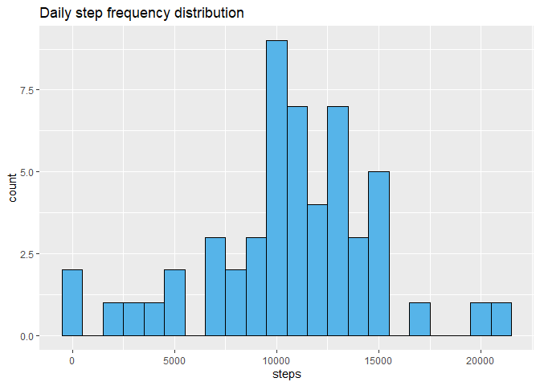
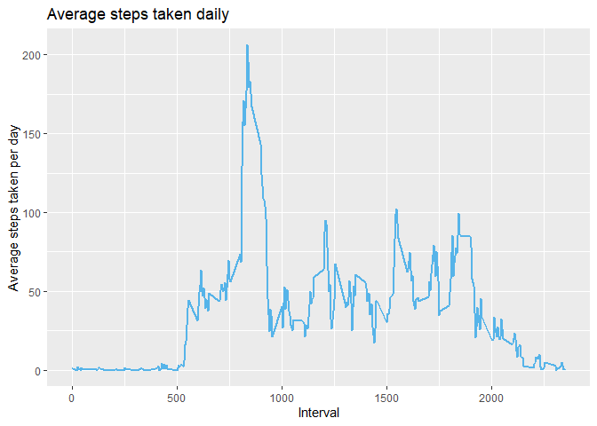
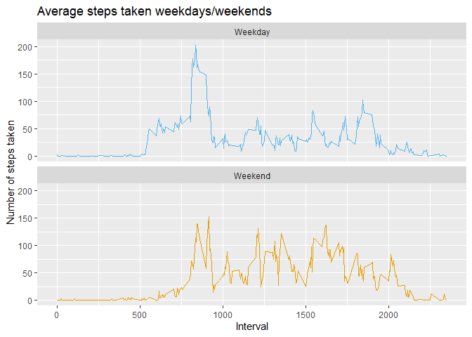

---
title: "Reproducible Research Poject 1"
author: "David Taylor"
date: "10/8/2020"
output: 
  html_document: 
    keep_md: yes
---

# Introduction

It is now possible to collect a large amount of data about personal movement using activity monitoring devices such as a Fitbit, Nike Fuelband, or Jawbone Up. These type of devices are part of the “quantified self” movement – a group of enthusiasts who take measurements about themselves regularly to improve their health, to find patterns in their behavior, or because they are tech geeks. But these data remain under-utilized both because the raw data are hard to obtain and there is a lack of statistical methods and software for processing and interpreting the data.  

This assignment makes use of data from a personal activity monitoring device. This device collects data at 5 minute intervals through out the day. The data consists of two months of data from an anonymous individual collected during the months of October and November, 2012 and include the number of steps taken in 5 minute intervals each day.  

The data for this assignment can be downloaded from the course web site:

* Dataset: [Activity monitoring data ](https://d396qusza40orc.cloudfront.net/repdata%2Fdata%2Factivity.zip) [52K]

The variables included in this dataset are:  

* **steps**: Number of steps taking in a 5-minute interval (missing values are coded as \color{red}{\verb|NA|}NA)
* **date**: The date on which the measurement was taken in YYYY-MM-DD format
* **interval**: Identifier for the 5-minute interval in which measurement was taken

The dataset is stored in a comma-separated-value (CSV) file and there are a total of 17,568 observations in this dataset.  


#### Load required R libraries and set options

```r
library(tidyverse)
```

```
## -- Attaching packages ------------------------------------------------------------------------------------------------------------------------------------- tidyverse 1.3.0 --
```

```
## v ggplot2 3.3.1     v purrr   0.3.4
## v tibble  3.0.1     v dplyr   1.0.0
## v tidyr   1.1.0     v stringr 1.4.0
## v readr   1.3.1     v forcats 0.5.0
```

```
## -- Conflicts ---------------------------------------------------------------------------------------------------------------------------------------- tidyverse_conflicts() --
## x dplyr::filter() masks stats::filter()
## x dplyr::lag()    masks stats::lag()
```

```r
knitr::opts_chunk$set(dev=c('png'))
options(scipen = 1, digits = 2)
```
## Load and pre-proces the data 

### Download and unzip data set, save in Data folder

```r
new_data_dir <- paste0(getwd(), '/Data')

if(!dir.exists(new_data_dir)) {
  dir.create(new_data_dir)
}

file_url<- "https://d396qusza40orc.cloudfront.net/repdata%2Fdata%2Factivity.zip"
dest_file <- paste0(getwd(), '/Data/activity.zip')

download.file(file_url, destfile = dest_file)
unzip(dest_file, exdir = "Data")
```


### Load data

```r
activity_data <- read.csv(file = 'Data/activity.csv')
```


## What is mean total number of steps taken per day?

1. Calculate the total number of steps taken per day

```r
steps_per_day <- activity_data %>%
                  group_by(date) %>%
                  summarize(n_steps = sum(steps), .groups = "drop_last")

head(steps_per_day)
```

```
## # A tibble: 6 x 2
##   date       n_steps
##   <chr>        <int>
## 1 2012-10-01      NA
## 2 2012-10-02     126
## 3 2012-10-03   11352
## 4 2012-10-04   12116
## 5 2012-10-05   13294
## 6 2012-10-06   15420
```
2. If you do not understand the difference between a histogram and a barplot, research the difference between them. Make a histogram of the total number of steps taken each day

```r
ggplot(steps_per_day, aes(x = n_steps)) +
  geom_histogram(color = "black", fill = "#56B4E9", binwidth = 1000) +
  labs(title = "Daily step frequency distribution", x= "steps", y = "count")
```

```
## Warning: Removed 8 rows containing non-finite values (stat_bin).
```

<!-- -->


3. Calculate and report the mean and median of the total number of steps taken per day

```r
steps_per_day %>% summarize(mean_setps = mean(n_steps, na.rm = TRUE), 
                            median_setps = median(n_steps, na.rm = TRUE))
```

```
## # A tibble: 1 x 2
##   mean_setps median_setps
##        <dbl>        <int>
## 1     10766.        10765
```
## What is the average daily activity pattern?
1. Make a time series plot (i.e. \color{red}{\verb|type = "l"|}type = "l") of the 5-minute interval (x-axis) and the average number of steps taken, averaged across all days (y-axis)

```r
steps_per_interval <- activity_data %>%
                        group_by(interval) %>%
                        summarize(n_steps = mean(steps, na.rm = TRUE),
                                  .groups = "drop_last")

ggplot(steps_per_interval, aes(x = interval, y = n_steps)) +
  geom_line(color = "#56B4E9", size = 0.75) +
  labs(title = "Average steps taken daily", x= "Interval", 
        y = "Average steps taken per day")
```

<!-- -->
2. Which 5-minute interval, on average across all the days in the dataset, contains the maximum number of steps?

```r
steps_per_interval %>%
    filter(n_steps == max(n_steps)) %>%
    select(interval) %>%
    rename(max_steps_interval = interval)
```

```
## # A tibble: 1 x 1
##   max_steps_interval
##                <int>
## 1                835
```
## Imputing missing values
Note that there are a number of days/intervals where there are missing values (coded as \color{red}{\verb|NA|}NA). The presence of missing days may introduce bias into some calculations or summaries of the data.

1. Calculate and report the total number of missing values in the dataset (i.e. the total number of rows with \color{red}{\verb|NA|}NAs)

```r
sum(is.na(activity_data$steps))
```

```
## [1] 2304
```
2. Devise a strategy for filling in all of the missing values in the dataset. The strategy does not need to be sophisticated. For example, you could use the mean/median for that day, or the mean for that 5-minute interval, etc.
3. Create a new dataset that is equal to the original dataset but with the missing data filled in.


```r
#Impute NAs with median for each day
activity_data_noNA <- activity_data %>%
                        mutate(steps = ifelse(is.na(steps), 
                                median(steps, na.rm = TRUE), steps))

#test if all NAs have been replaced
sum(is.na(activity_data_noNA$steps))
```

```
## [1] 0
```
4. Make a histogram of the total number of steps taken each day and Calculate and report the mean and median total number of steps taken per day. Do these values differ from the estimates from the first part of the assignment? What is the impact of imputing missing data on the estimates of the total daily number of steps?

```r
steps_per_day_noNA <- activity_data_noNA %>%
                        group_by(date) %>%
                        summarize(n_steps = sum(steps), .groups = "drop_last")

ggplot(steps_per_day_noNA, aes(x = n_steps)) +
  geom_histogram(color = "black", fill = "#56B4E9", binwidth = 1000) +
  labs(title = "Daily step frequency distribution", x= "Steps", 
       y = "Count")
```

<!-- -->

```r
estimates_NAs <- steps_per_day %>% 
                  summarize(mean_setps = mean(n_steps, na.rm = TRUE), 
                  median_setps = median(n_steps, na.rm = TRUE)) %>%
                  mutate(type = "with NAs")

estimates_noNAs <- steps_per_day_noNA %>% 
                    summarize(mean_setps = mean(n_steps), 
                    median_setps = median(n_steps)) %>%
                    mutate(type = "Imputed NAs")

estimate_Na_noNA <- rbind(estimates_NAs, estimates_noNAs)
```


### Observations  
1. The estimates differ as can be seen the the table below. In particular, the mean is more sensitive to extreme cases (zeros) and exhibits a larger difference.  

estimate type | mean steps | median_steps
-------- | -------- | --------
first part with NAs | 10766.19 | 10765
Second part impute with median | 9354.23 | 10395
2. Imputing the NAs with the median number of steps per day has created a large peak in the distribution at zero steps (full days with NAs). 

## Are there differences in activity patterns between weekdays and weekends?
For this part the \color{red}{\verb|weekdays()|}weekdays() function may be of some help here. Use the dataset with the filled-in missing values for this part.

1. Create a new factor variable in the dataset with two levels – “weekday” and “weekend” indicating whether a given date is a

```r
#Transform date string in to a date object POSIXt for weekday() function (steps broken down for clarity).

activity_data <- activity_data %>%
                  mutate(date = as.POSIXct(date, format = "%Y-%m-%d")) %>%
                  mutate(week_day = weekdays(date)) %>%
                  mutate(week_day = ifelse(week_day %in% c("Saturday", "Sunday"),
                                           "Weekend", "Weekday"))%>%
                  mutate(week_day = as.factor(week_day))

head(activity_data)
```

```
##   steps       date interval week_day
## 1    NA 2012-10-01        0  Weekday
## 2    NA 2012-10-01        5  Weekday
## 3    NA 2012-10-01       10  Weekday
## 4    NA 2012-10-01       15  Weekday
## 5    NA 2012-10-01       20  Weekday
## 6    NA 2012-10-01       25  Weekday
```
2. Make a panel plot containing a time series plot (i.e. \color{red}{\verb|type = "l"|}type = "l") of the 5-minute interval (x-axis) and the average number of steps taken, averaged across all weekday days or weekend days (y-axis). See the README file in the GitHub repository to see an example of what this plot should look like using simulated data. 

```r
#Impute NAs with median for each day
activity_data_noNA <- activity_data %>%
                        mutate(steps = ifelse(is.na(steps), 
                                median(steps, na.rm = TRUE), steps))

steps_per_day_noNA <- activity_data_noNA %>%
                        group_by(interval, week_day) %>%
                        summarize(n_steps = mean(steps), .groups = "drop_last")

ggplot(steps_per_day_noNA, aes(x = interval, y = n_steps, color = week_day)) +
  geom_line(size = 0.5) +
  scale_color_manual(values=c("#56B4E9", "#E69F00")) +
  labs(title = "Average steps taken weekdays/weekends", x = "Interval", 
      y = "Number of steps taken") +
  theme(legend.position = "none") +
  facet_wrap(~week_day, ncol = 1, nrow = 2)
```

<!-- -->
